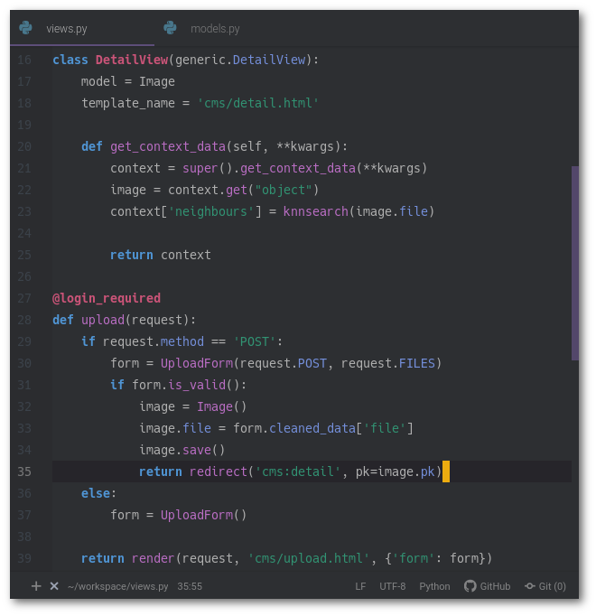
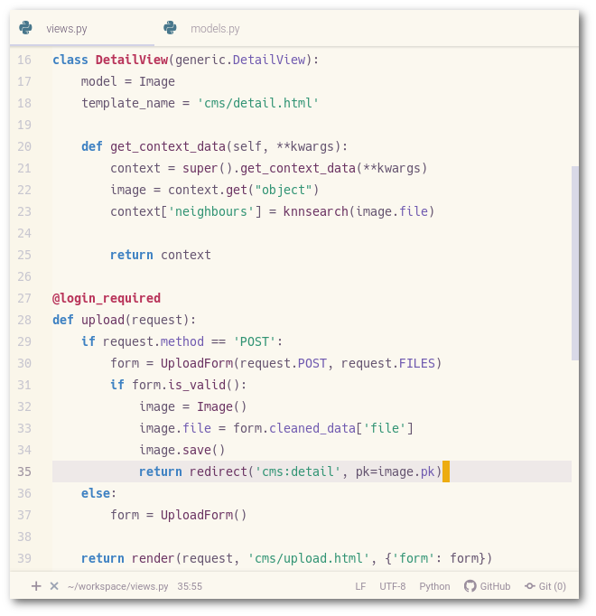

# Spacemacs Theme for Atom (Dark & Light)

This is an adaption of Spacemacs theme for Atom.
The original theme is a wonderful work [nashamri/spacemacs-theme](https://github.com/nashamri/spacemacs-theme).

## Screenshots

With [Atom Material UI](https://github.com/atom-material/atom-material-ui).

You can get closer to the original atmosphere by setting primary color as #5d4d7a for Dark theme, and  #d3d3e7 for Light theme.
